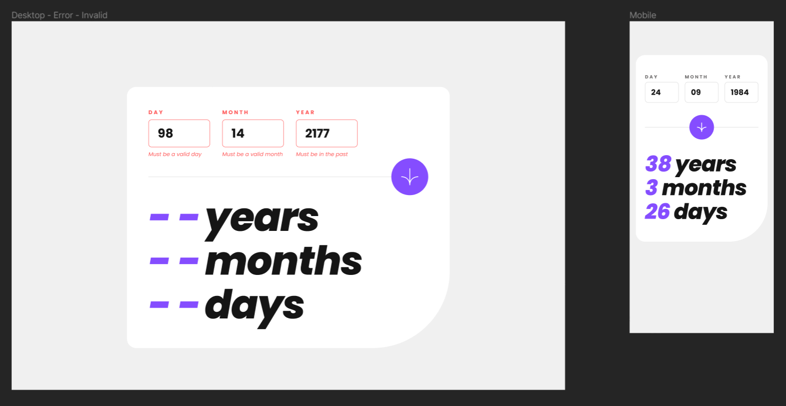
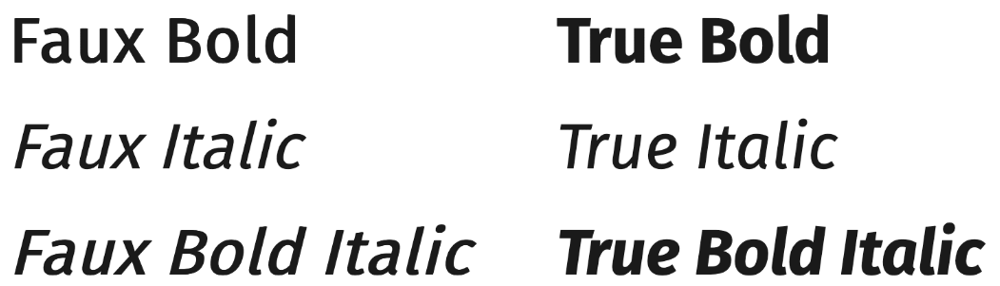

# Frontend Mentor - Age calculator app solution

This is a solution to the [Age calculator app challenge on Frontend Mentor](https://www.frontendmentor.io/challenges/age-calculator-app-dF9DFFpj-Q). Frontend Mentor challenges help you improve your coding skills by building realistic projects. 

## Table of contents

- [Overview](#overview)
  - [The challenge](#the-challenge)
  - [Screenshot](#screenshot)
  - [Links](#links)
- [My process](#my-process)
  - [Built with](#built-with)
  - [What I learned](#what-i-learned)
  - [Continued development](#continued-development)
  - [Useful resources](#useful-resources)
- [Author](#author)

## Overview

### The challenge

Users should be able to:

- [ ] View an age in years, months, and days after submitting a valid date through the form
- [ ] Receive validation errors if:
  - [ ] Any field is empty when the form is submitted
  - [ ] The day number is not between 1-31
  - [ ] The month number is not between 1-12
  - [ ] The year is in the future
  - [ ] The date is invalid e.g. 31/04/1991 (there are 30 days in April)
- [ ] View the optimal layout for the interface depending on their device's screen size
- [ ] See hover and focus states for all interactive elements on the page
- [ ] **Bonus**: See the age numbers animate to their final number when the form is submitted

### Screenshot

Here is the Figma design:


And here's my solution:


### Links

- Solution URL: [Github](https://github.com/JoleneKearse/fem-age-calculator-app)
- Live Site URL: [Add live site URL here](https://your-live-site-url.com)

## My process

### Built with

- Semantic HTML5 markup
- `@font-face`
- CSS custom properties
- Flexbox
- CSS Grid
- Mobile-first workflow

### What I learned

#### How to use provided fonts! 🫣

When starting up my **stylesheet**, I went to **[Google Fonts](https://fonts.google.com/) out of habit, selected the needed styles, and started copy and pasting what I _thought_ I needed...

But hold up! I see a `fonts` directory in my `assets`. 

I'd never seen that, so I had to do some Googling. _Like I could've totally continued business-as-usual, but what a great opportunity to learn!_ 

So I set it up at the top of my stylesheet. Specifically declaring weights and styles:

```css
@font-face {
  font-family: "Poppins";
  src: url("assets/fonts/Poppins-Bold.ttf") format("truetype");
  font-weight: 700;
  font-style: normal;
}
```

I found out you needed to declare the specifics to avoid the browsers' _faux versions_ of `font-styles`. **Bold** text is created by adding a **stroke to the font**, while **italic** text is just **slanted** by the browser. So setting up a `@font-face` rule for each style will get the true typography.



### Continued development


### Useful resources

- [Loading a Self-Hosted Font with `@font-face`](https://www.digitalocean.com/community/tutorials/how-to-load-and-use-custom-fonts-with-css#loading-a-self-hosted-font-with-font-face) - This showed me how to use provided fonts via CSS and how to avoid _faux_ rendering.
- [Example resource 2](https://www.example.com) - This is an amazing article which helped me finally understand XYZ. I'd recommend it to anyone still learning this concept.


## Author

Hiya! 👋 My name is **Jolene Kearse**.  

I was an **English as a Foreign Language Teacher** ️🌏🧑‍🏫 for over 15 years - so, yeah, _for a little bit_ 🤌...  I lived all over the world, including China, England & South Korea.

Now I'm an awesome **Software Engineer**! 💃 I'm a **proud, self-taught individual**. 

I'm also proud of how far I came in 2022.  I finally learned **JavaScript**! 🍻 _I had struggled for about a year before I finally could add that to my skillset.  If you're interested in an awesome 🔥 course check out **[Class Central's Bootcamp YouTube Playlist going through freeCodeCamp's Algorithms and Data Structures Certification](https://www.youtube.com/playlist?list=PLU3RKvMpgrSEoqVIV14K_zuinrIBcnCgT).**

Then I met an awesome group of fellow-learning devs, **The Explorers**.  This exposed me to the myriad and oft-confusing ways of using **Git** in a team - loving it now!  But also projects using so many kinds of tech that would've just blown my mind a year before 🤯 including:
- React
- TypeScript
- Tailwind

I even participated in **[#Hacktoberfest](https://hacktoberfest.com/)** and earned the coveted T-shirt! 🎉👕


In *2023* I've been boning up on **React**, and just taking so many courses to learn **Backend Development** and **navigate the process of earning my first tech job**!

One of those courses has seen me going back to **Python** - which I had treated as my _crutch language_ to understand JavaScript.  🤣  But I've been loving navigating in multiple languages.

Another challenge I am undertaking this year is [Exercism's](https://exercism.org/) **#12in23**.  This is a cool 😎 opportunity to _try out_ 12 different languages this year.  Each month has a theme, like **Functional February** and **Mechanical March** to encourage you to check out different language paradims.  I'm loving this chance to dip my toe in other types of programming.  I find I'm gaining the ability to evaluate various languages' strengths and project needs.

Let's connect! 💬

- Frontend Mentor - [Jolene Kearse](https://www.frontendmentor.io/profile/JoleneKearse)
- LinkedIn - [Jolene Kearse](https://www.linkedin.com/in/jolene-kearse-2562ba218/)
- Twitter - [JoleneFromCanada](https://twitter.com/FromJolene)
